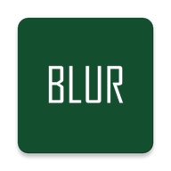
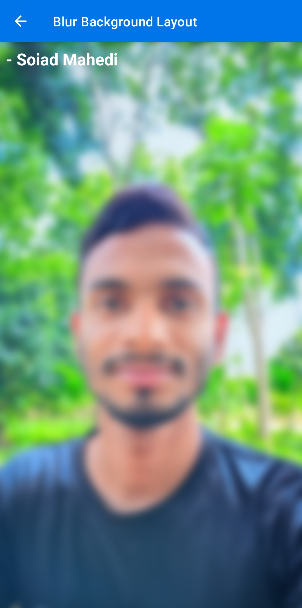
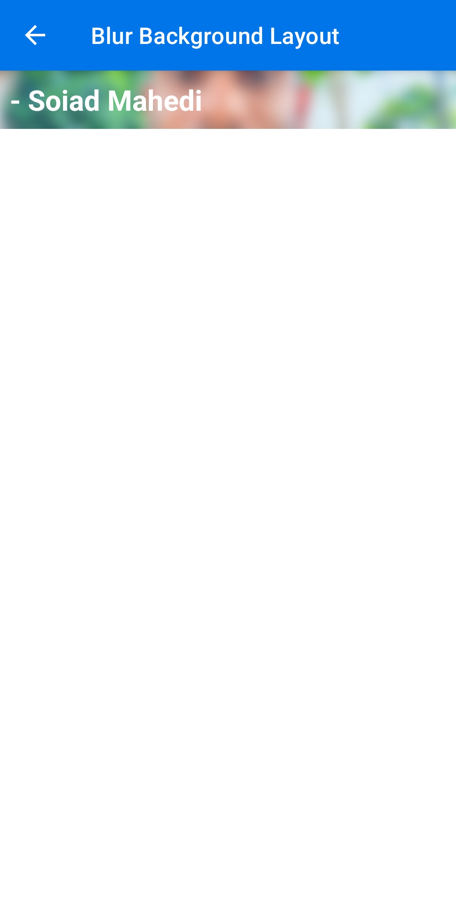

# Blur Background Layout
**by Soiad Mahedi**



## 📸 Screenshots
<p>
  
  
</p>

**BlurBackgroundLayout** is a custom Android view that allows you to set a background image and optionally blur it.  
It’s perfect for creating beautiful UI layouts with blurred background effects, while keeping your content sharp and readable.

---

## ✨ Features
- Set a background image with ease.
- Enable/disable blur dynamically.
- Adjustable blur radius (default: `25f`).
- Uses `RenderEffect` on Android 12+ for performance.
- Uses `RenderScript` for older devices.
- Supports any `LinearLayout` content inside.

---

## 📦 Installation

### 1. Copy the class
Copy the file [`BlurBackgroundLayout.java`](app/src/main/java/com/soiadmahedi/blurbackgroundlayout/BlurBackgroundLayout.java) into your project’s package.

### 2. Add to your layout XML
```xml
<com.soiadmahedi.blurbackgroundlayout.BlurBackgroundLayout
    android:id="@+id/linear_blurbackgroundlayout"
    android:layout_width="match_parent"
    android:layout_height="match_parent">

    <!-- Your content here -->
    <LinearLayout
        android:layout_width="match_parent"
        android:layout_height="wrap_content"
        android:gravity="center"
        android:orientation="vertical">

        <TextView
            android:layout_width="wrap_content"
            android:layout_height="wrap_content"
            android:text="Hello Blur!"
            android:textColor="@android:color/white"
            android:textSize="22sp" />

    </LinearLayout>

</com.soiadmahedi.blurbackgroundlayout.BlurBackgroundLayout>
```

### 💻 Usage in Java
```java
BlurBackgroundLayout blurLayout = findViewById(R.id.linear_blurbackgroundlayout);

// Set background image
blurLayout.setBackgroundImage(R.drawable.image_soiadmahedi);

// Enable blur
blurLayout.enableBlur(true);

// Disable blur
blurLayout.enableBlur(false);
```

### ⚙️ Requirements
Android Version: API 16+ (Blur effect works best on API 17+)
- Java / Kotlin Compatible

## 👨‍💻 Author
**Soiad Mahedi**  
[GitHub Profile](https://github.com/soiadmahedi)
